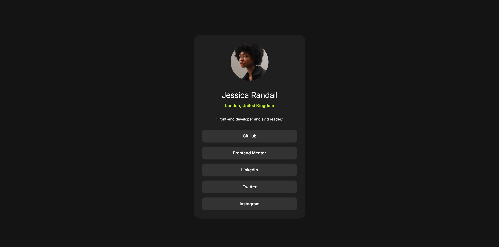

# Frontend Mentor - Social links profile solution

This is a solution to the [Social links profile challenge on Frontend Mentor](https://www.frontendmentor.io/challenges/social-links-profile-UG32l9m6dQ). Frontend Mentor challenges help you improve your coding skills by building realistic projects. 

## Table of contents

- [Overview](#overview)
  - [The challenge](#the-challenge)
  - [Screenshot](#screenshot)
  - [Links](#links)
- [My process](#my-process)
  - [Built with](#built-with)
  - [What I learned](#what-i-learned)
  - [Continued development](#continued-development)
  - [Useful resources](#useful-resources)
- [Author](#author)

## Overview

Simple card that has "links" to social media. 

### The challenge

Users should be able to:

- See hover and focus states for all interactive elements on the page

### Screenshot

### Links

- Solution URL: [Add solution URL here](https://your-solution-url.com)
- Live Site URL: [https://social-links1.netlify.app](https://social-links1.netlify.app)

## My process

Set up HTML, then fine tuned the mobile version. After mobile was ready, added active states and finished with a small media query for desktop sizing.

### Built with

- Semantic HTML5 markup
- CSS custom properties
- CSS Grid
- Mobile-first workflow

### What I learned

Went through this project pretty easily. 

### Continued development

Looking to keep an even pace when approaching problems and work. Putting self appointed pressure to get it done "fast", doesn't help me get it done any faster. 

### Useful resources

Used no resources.

## Author

- LinkedIn - [Alfonso Alvarez](https://www.linkedin.com/in/alfonso-alvarez-4223b628b/)
- Frontend Mentor - [@Alfonso-1701](https://www.frontendmentor.io/profile/Alfonso-1701)

